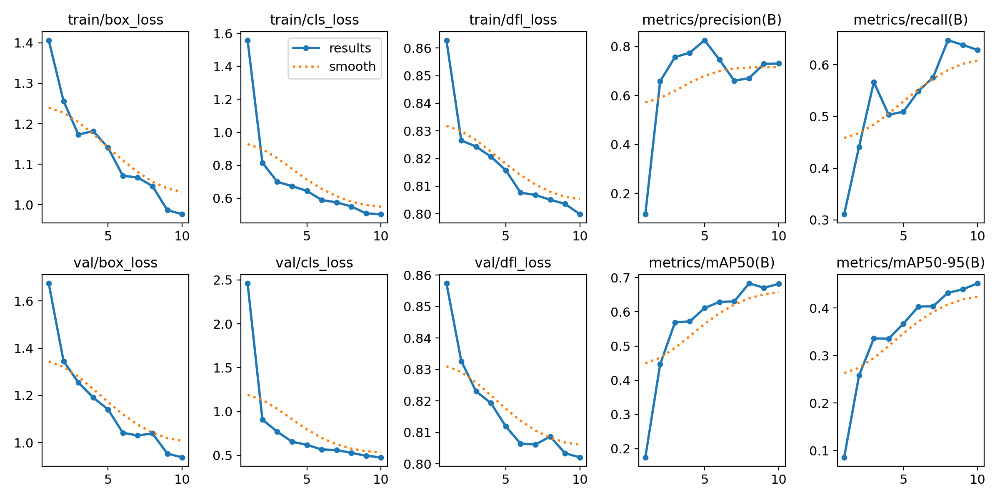

<h1 align="center">Football Analysis System ⚽</h1>

<p align="center">
   
    
   
</p>

## 📋 Table of Contents
- [🌟 Introduction](#-introduction)
- [🗃️ Dataset](#️-dataset)
- [🧠 Training](#-training)
- [🛠️ Requirements](#️-requirements)
- [💻 Installation](#-installation)
- [🖥️ Usage](#️-usage)
- [🤝 Contributing](#-contributing)

## 🌟 Introduction

This project implements an advanced football analysis system utilizing a custom YOLOv5 model trained on a labeled dataset of football match images. The system offers a comprehensive suite of analytical features:

- 👥 Player, goalkeeper, and referee tracking
- 🏃‍♂️ Real-time velocity estimation and distance covered by players
- ⚽ Ball possession statistics for each team
- 📹 Horizontal and vertical camera motion analysis

All features are visually represented through video frames using OpenCV, providing intuitive and actionable insights for coaches, analysts, and enthusiasts.

## 🗃️ Dataset

The model is trained on a robust dataset comprising:
- 612 training images
- 38 validation images

All images are pre-labeled for optimal training efficiency. You can acquire dataset tailored to your specific model requirements from the [Football Players Detection Dataset](https://universe.roboflow.com/roboflow-jvuqo/football-players-detection-3zvbc/dataset/1) on Roboflow Universe.

## 🧠 Training

The YOLOv5 model underwent rigorous training for 10 epochs, yielding impressive performance metrics:

| Metric | Train | Validation |
|--------|-------|------------|
| Box Loss | 0.97 | 0.93 |
| Class Loss | 0.50 | 0.47 |

The following graph illustrates the model's performance across epochs:

<p align="center">
  <br/>
  <em>Training Performance Metrics</em>
</p>

## 🛠️ Requirements

Ensure you have the following dependencies installed:

- Ultralytics 8.2
- Roboflow 1.1.41
- PyTorch 2.3.1
- OpenCV 4.10

## 💻 Installation

1. Clone the repository:
```bash
git clone https://github.com/hieplt23/football_analysis.git
cd football_analysis
```
2. Set up a virtual environment (recommended):
```bash
python -m venv .venv
source .venv/bin/activate  # On Windows use `.venv\Scripts\activate`
```
3. Install the required packages:
```bash
pip install -r requirements.txt
```

## 🖥 Usage
1. Train the model using the provided Jupyter notebook: ``./training/football_training_yolov5s.ipynb``
2. Run the analysis system:
- Place your input video in the ``./input_videos`` directory
- Update the ``video_frames`` variable in ``main.py`` with your input video path
- Execute the main script: ``python main.py``. Find the output video at ``./output_videos/output.avi``
<p align="center">
 </br>
  <em>System Demo</em>
</p>

## 🤝 Contributing
We welcome contributions to enhance the functionality and performance of this football analysis system. Please feel free to submit a Pull Request or open an Issue for discussions.
